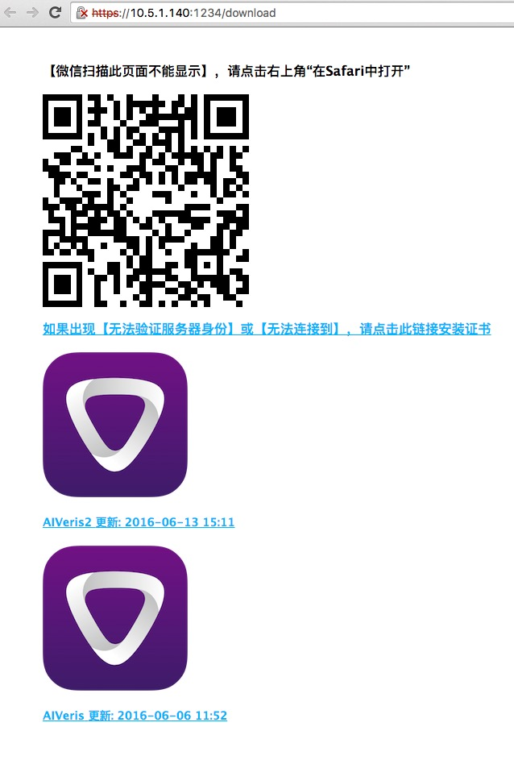

自动生成自签名HTTPS服务器，快速安装ipa

[README For English](./README-en.md)

# 支持
* OS X
* Ubuntu
* CentOS
* 其他平台未测试

# 需要
* [nodejs](https://nodejs.org/)

# 安装
```
$ npm install -g ios-ipa-server
```

# 用法
```
Usage: ios-ipa-server [option] [dir]

Options:

-h, --help                output usage information
-V, --version             output the version number
-p, --port <port-number>  set port for server (defaults is 1234)
-i, --ip <ip-address>     set ip address for server (defaults is automatic getting by program)
```

## 开启服务
```
$ cd /path/of/ipa
$ ios-ipa-server

# or

$ ios-ipa-server /path/of/ipa


# open https://ip:port/download on your iphone
```

### 关于`ipa`打包方法
* [Ad-hoc](https://developer.apple.com/library/ios/documentation/IDEs/Conceptual/AppDistributionGuide/TestingYouriOSApp/TestingYouriOSApp.html)
* [企业级分发](https://developer.apple.com/library/ios/documentation/IDEs/Conceptual/AppDistributionGuide/DistributingEnterpriseProgramApps/DistributingEnterpriseProgramApps.html)
* 普通开发者账号推荐使用[shenzhen](https://github.com/nomad/shenzhen)打包生成`ipa`

### 安装app
* 手机使用safari打开`https://ip:port/download`页面
* 第一次打开会弹出警告`无法验证服务器`，请点击`详细信息`按钮安装证书，按指示一直点击下一步和完成(**强烈推荐使用静态IP，避免每次重新安装证书**)
* 点击`ipa`链接在线安装`ipa`
* iOS 10.3 [安装方法](https://github.com/bumaociyuan/ios-ipa-server/issues/23) Settings > General > About (logically...) > Certificate Trust Settings > Enable Full Trust for Root Certificates


# 效果图



# 开发

```
# 下载源码
$ git clone git@github.com:bumaociyuan/ios-ipa-server.git

# 安装依赖包
$ cd ios-ipa-server
$ npm install 

# 建立link 方便调试
$ npm link

# 运行
$ cd /path/of/ipa
$ ios-ipa-server
```

# TODO

- [ ] 支持多语言
- [ ] 支持[shenzhen](https://github.com/nomad/shenzhen)
- [ ] 支持上传IPA


# Lisence
[MIT](https://github.com/bumaociyuan/zxIpaServer/blob/master/LICENSE.md)
